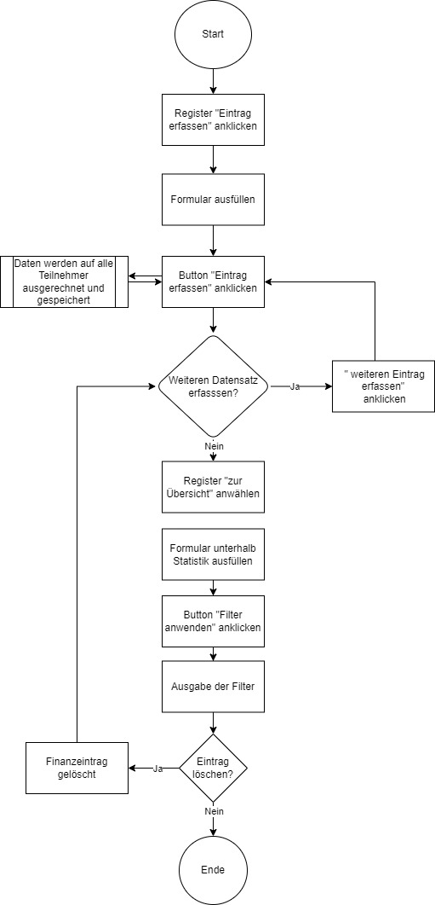

# Semesterarbeit - Abrechnen in der WG

## 1. Ausgangslage
Aktuell werden die Einkäufe in der Wohngemeinschaft (nachfolgend mit WG abgekürzt) manuel und sporadisch untereinander verrechnet.

## 2. Projektidee
Mit der Webapplikation soll es für die Mitglieder aus der WG die Finanzübersicht erleichtern, indem getätigte Einkäufe in der Applikation eingetragen werden können und diese es auf die angewählten Mitbewohner verteilt.
## 3. Ablauf Diagramm

    
### 3.1 Installation / Benutzung
Damit die Applikation funktionieren kann, müssen folgende Module importiert werden:
- Flask (Flask, render_template, request)
- Plotly (plotly.express as px)
- json
- uuid gehört zu Phyton und generiert zufällige id's
#### 3.1.1 Startseite
Durch das Anwählen des Buttons auf der Startseite gelangt der User auf die Seite Finanzeintrag erfassen.
#### 3.1.2 Erfassen
Der User kann einen neuen Finanzeintrag tätigen. Folgende Daten müssen dafür eingegeben werden:
  - Kategorie auswählen
    - Nebenkosten
    - Wocheneinkauf
    - Küche
    - Bad
    - Diverse
  - Beschreibung (Text)
  - Preis von dem Einkauf (Zahl)
  - Datum des Einkaufs anwählen
  - Mitglieder, die zu schuldner werden anwählen
    - Tamara
    - Mara
    - Gian
    - Rouven
    - Linda
- Wird der Button "Finanzeintrag speichern" angewählt, werden die Angaben des Users in der Datenbank "datenbank_finanzeintragdaten.json" in einem Dic gespeichert.
    - Wird ein Feld leer gelassen, kommt eine Fehlermeldung, welche den User bittet die Daten einzugeben.
- Sobald alles eingegeben ist und der Button betätigt wird, kommt der User auf eine Zwischenseite um weitere aktionen machen zu können.

#### 3.1.3 Übersicht
- Unter Übersicht wird aufgezeigt, welches Mitglied wie viel Geld an einem Schuldet. Dies wurde mit einem Balkendiagramm dargestellt. Aus zeitlichen Gründen konnten feinheiten wie x und y-Achse benennen nicht mehr gemacht werden.
- Der Rechner im Hintergrund rechnet für das Balkendiagramm die Einkäufe mit den angewählten Mitgliedern aus.
- Mit dem Filter kann nach Einträgen gesucht werden. Folgende Einträge müssen eingegeben werden.
  - Kategorien (auswählen)
  - Mitbewohner (auswählen)
  - wird der Button "Filter anwenden" getätigt, werden die Angaben vom User mit den vorhandenen einträgen abgeglichen und angezeigt.
- Einträge können gelöscht werden. Wurde ein Eintrag gelöscht, kommt der User auf eine Zwischenseite um weitere aktionen vornehmen zu können.

### 3.2 Vorhandene Funktionen
- Dateneingabe: Neue Finanzeinträge, Abfrage für Finanzübersicht
- Datensicherung: Mitglieder werden in einer JSON-Datei gespeichert
- Datenverarbeitung: Mittels for-Schleife wird eine Datenbank Abfrage gemacht, wie viel die einzelnen Mitglieder schulden
- Datenausgabe: Ausgabe der Schulden von den Mitgliedern als Balkendiagramm.

## FAQ`s (Fazit)
###### Was funktioniert noch nicht - und warum nicht
- Beim Balkendiagramm versuchte ich die einzelnen Kategorien in unterschiedlichen Farben darzustellen. Dies hat nicht funktioniert, weil ich nicht wusste mit welchem Code ich die Kategorien auf die y-Achse verweisen kann. Leider konnte ich nicht einmal benennen, dass y = CHF ist und x = Mitbewohner.

###### wie ist es mir dabei gelaufen
Zu Beginn ist es mir sehr gut gelaufen, jedoch habe ich in der Mitte gemerkt, dass ich vieles besser auf eine andere Art und Weise begonnen hätte. Beispielsweise würde ich die Kategorien nicht mehr als Checkbox machen, sondern als radio. Dies würde sodann auch einfacher werden für die weitere verarbeitung im Code.
Ich musste den Teil "Neue Mitglieder zu erfassen" aus zeitlichen Gründen weglassen. Dies verwirrte mich anfänglich etwas mein Löschen vom Code, weil bereits alles verknüpft war.
