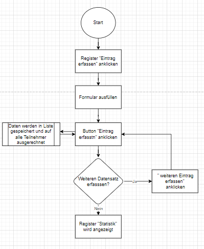

# Semesterarbeit - Abrechnen in der WG

## 1. Ausgangslage
Aktuell werden die Einkäufe in der Wohngemeinschaft (nachfolgend mit WG abgekürzt) manuel und sporadisch untereinander verrechnet.

## 2. Projektidee
Mit der Webapplikation soll es für die Mitglieder aus der WG die Fananzübersicht erleichtern, indem getätigte Einkäufe direkt auf die Mitbewohner welche ausgewählt werden können verteilt.
## 3. Ablauf Diagramm

    
### 3.1 Installation / Benutzung
Damit die Applikation funktionieren kann, müssen folgende Module importiert werden:
- Flask (Flask, render_template, request, redirect, url_for)
- Plotly (plotly.express as px)
- uuid gehört zu Phyton und generiert zufällige id's
#### Startseite
Durch das Anwählen des jeweiligen Buttons gelangt der User auf die Seiten Finanzeintrag, Übersicht Finanzen und Archiv Mitbewohner.
#### Erfassen
Der User kann einen neuen Finanzeintrag tätigen. Folgende Daten müssen dafür eingegeben werden:
  - Kategorie auswählen
    - Nebenkosten
    - Wocheneinkauf
    - Küche
    - Bad
    - Diverse
  - Beschreibung (Text)
  - Preis von dem Einkauf (Zahl)
  - Datum des Einkaufs anwählen
  - Mitglieder, die zu schuldner werden anwählen
    - Tamara
    - Mara
    - Gian
    - Rouven
    - Linda
Wird der Button "Finanzeintrag speichern angewählt, werden die Angaben des Users in der Datenbank "datenbank_finanzeintragdaten.json" in einem Dic gespeichert.
    - Wird ein Feld leer gelassen, kommt eine Fehlermeldung, welche den User bittet die Daten einzugeben.
    - Sobald alles eingegeben ist und der Button betätigt wird, kommt der User auf eine zwischenseite um weitere aktionen machen zu können.

#### Übersicht
- Unter Übersicht wird aufgezeigt, welches Mitglied wie viel Geld an einem Schuldet. Dies wollte mit einem Diagramm dargestellt werden. Leider konnte dies aus zeitlichen Gründen nicht fertig umgesetzt werden.
- Der Rechner im Hintergrund rechnet die Einkäufe mit den angewählten Mitgliedern aus.

### 3.2 Vorhandene Funktionen
- Dateneingabe: Neue Finanzeinträge, Abfrage für Finanzübersicht
- Datensicherung: Mitglieder werden in einem JSON-Datei gespeichert
- Datenverarbeitung: Mittels For-Schleife wird eine Datenbank Abfrage gemacht, wie viel die einzelnen Mitglieder schulden
- Datenausgabe: Ausgabe der Schulden von den Mitgliedern.
### 3.3 Zutaten

## FAQ`s (Fazit)
###### Was funktioniert noch nicht - und warum nicht
###### wie ist es mir dabei gelaufen

